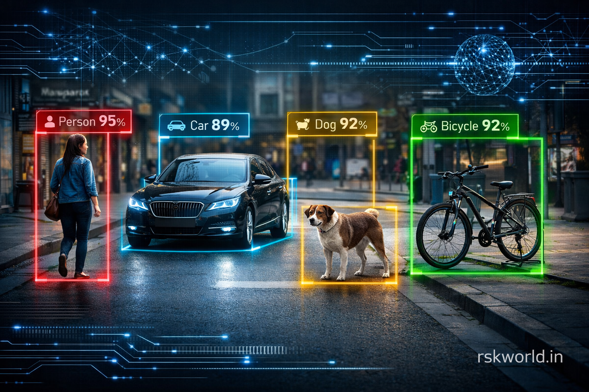

# 🎯 Object Detection Dataset

<p align="center">
  
</p>

<p align="center">
  <strong>Annotated object detection dataset with bounding boxes for training YOLO, R-CNN, and other object detection models.</strong>
</p>

<p align="center">
  <a href="https://rskworld.in">
    
  </a>
  <a href="./LICENSE"></a>
  
  
</p>

---

## 📋 Table of Contents

- [Overview](#overview)
- [Features](#features)
- [Dataset Structure](#dataset-structure)
- [Object Classes](#object-classes)
- [Annotation Formats](#annotation-formats)
- [Installation](#installation)
- [Usage](#usage)
- [Training Examples](#training-examples)
- [License](#license)
- [Contact](#contact)

---

## 🔍 Overview

This dataset includes images with annotated bounding boxes and class labels for object detection tasks. Perfect for training **YOLO**, **R-CNN**, **SSD**, and other object detection models, as well as computer vision research.

### Key Statistics

| Metric | Value |
|--------|-------|
| Total Images | 1000+ |
| Object Classes | 10 |
| Total Annotations | 5000+ |
| Training Set | 800 images (80%) |
| Validation Set | 200 images (20%) |
| Image Resolution | Variable (640x480 typical) |
| Format | PNG, JPG |

---

## ✨ Features

- ✅ **Bounding Box Annotations** - Precise coordinates for every object
- ✅ **Multiple Object Classes** - 10 different categories
- ✅ **Training and Validation Sets** - Pre-split 80/20
- ✅ **YOLO Format Compatible** - Ready for YOLOv5, YOLOv7, YOLOv8
- ✅ **COCO Format Available** - Works with Detectron2, MMDetection
- ✅ **High Quality Images** - Diverse lighting and backgrounds

---

## 📁 Dataset Structure

```
object-detection-dataset/
├── train/
│   ├── images/           # 800 training images
│   │   ├── image_001.jpg
│   │   ├── image_002.jpg
│   │   └── ...
│   └── labels/           # YOLO format annotations
│       ├── image_001.txt
│       ├── image_002.txt
│       └── ...
├── valid/
│   ├── images/           # 200 validation images
│   │   ├── image_801.jpg
│   │   └── ...
│   └── labels/           # YOLO format annotations
│       ├── image_801.txt
│       └── ...
├── data.yaml             # YOLO configuration file
├── annotations.json      # COCO format annotations
├── classes.txt           # Class names list
└── README.md             # This file
```

---

## 🏷️ Object Classes

| ID | Class Name | Instances | Description |
|----|------------|-----------|-------------|
| 0 | person | 1200+ | Human figures |
| 1 | car | 800+ | Cars and automobiles |
| 2 | dog | 450+ | Dogs of various breeds |
| 3 | cat | 400+ | Cats of various breeds |
| 4 | bicycle | 350+ | Bicycles |
| 5 | motorcycle | 300+ | Motorcycles |
| 6 | bus | 250+ | Buses |
| 7 | truck | 280+ | Trucks |
| 8 | bird | 350+ | Various bird species |
| 9 | chair | 420+ | Chairs and seating |

---

## 📝 Annotation Formats

### YOLO Format (txt files)

Each image has a corresponding `.txt` file with the same name containing:

```
class_id x_center y_center width height
```

All values are normalized (0-1):

```
0 0.453125 0.546875 0.234375 0.687500
1 0.765625 0.421875 0.312500 0.234375
2 0.156250 0.718750 0.187500 0.250000
```

### COCO Format (JSON)

Complete annotations in `annotations.json`:

```json
{
  "images": [
    {"id": 1, "file_name": "image_001.jpg", "width": 640, "height": 480}
  ],
  "annotations": [
    {
      "id": 1,
      "image_id": 1,
      "category_id": 0,
      "bbox": [x, y, width, height],
      "area": 49500
    }
  ],
  "categories": [
    {"id": 0, "name": "person"}
  ]
}
```

---

## 🚀 Installation

### 1. Download the Dataset

```bash
# Download from RSK World
wget https://rskworld.in/object-detection/object-detection.zip

# Or use the direct download link
curl -O https://rskworld.in/object-detection/object-detection.zip
```

### 2. Extract the Dataset

```bash
unzip object-detection.zip -d ./data/
```

### 3. Install Dependencies

```bash
# For YOLOv8 (Ultralytics)
pip install ultralytics opencv-python

# For YOLOv5
pip install torch torchvision
git clone https://github.com/ultralytics/yolov5
cd yolov5
pip install -r requirements.txt
```

---

## 💻 Usage

### With YOLOv8

```python
from ultralytics import YOLO

# Load a pre-trained model
model = YOLO('yolov8n.pt')

# Train the model on the dataset
results = model.train(
    data='data.yaml',
    epochs=100,
    imgsz=640,
    batch=16
)

# Run inference
results = model.predict('test_image.jpg')
```

### With YOLOv5

```bash
# Training
python train.py --img 640 --batch 16 --epochs 100 --data data.yaml --weights yolov5s.pt

# Inference
python detect.py --weights runs/train/exp/weights/best.pt --source test_image.jpg
```

### With OpenCV (Reading Annotations)

```python
import cv2
import os

def read_yolo_annotation(label_path, img_width, img_height):
    """Read YOLO format annotation and convert to pixel coordinates"""
    boxes = []
    with open(label_path, 'r') as f:
        for line in f:
            parts = line.strip().split()
            class_id = int(parts[0])
            x_center = float(parts[1]) * img_width
            y_center = float(parts[2]) * img_height
            width = float(parts[3]) * img_width
            height = float(parts[4]) * img_height
            
            x1 = int(x_center - width/2)
            y1 = int(y_center - height/2)
            x2 = int(x_center + width/2)
            y2 = int(y_center + height/2)
            
            boxes.append((class_id, x1, y1, x2, y2))
    return boxes

# Load and display image with boxes
img = cv2.imread('train/images/image_001.jpg')
h, w = img.shape[:2]
boxes = read_yolo_annotation('train/labels/image_001.txt', w, h)

class_names = ['person', 'car', 'dog', 'cat', 'bicycle', 
               'motorcycle', 'bus', 'truck', 'bird', 'chair']
colors = [(255,0,0), (0,255,0), (0,0,255), (255,255,0), (255,0,255),
          (0,255,255), (128,0,128), (128,128,0), (0,128,128), (128,0,0)]

for class_id, x1, y1, x2, y2 in boxes:
    cv2.rectangle(img, (x1, y1), (x2, y2), colors[class_id], 2)
    cv2.putText(img, class_names[class_id], (x1, y1-10),
                cv2.FONT_HERSHEY_SIMPLEX, 0.5, colors[class_id], 2)

cv2.imshow('Detection', img)
cv2.waitKey(0)
```

---

## 📊 Training Examples

### Basic Training Command (YOLOv8)

```bash
yolo train model=yolov8n.pt data=data.yaml epochs=100 imgsz=640
```

### Advanced Training with Custom Parameters

```bash
yolo train \
    model=yolov8s.pt \
    data=data.yaml \
    epochs=300 \
    imgsz=640 \
    batch=32 \
    lr0=0.01 \
    lrf=0.01 \
    momentum=0.937 \
    weight_decay=0.0005 \
    warmup_epochs=3.0 \
    augment=True \
    mosaic=1.0 \
    mixup=0.15
```

### Inference Command

```bash
yolo predict model=best.pt source=test_images/ conf=0.5
```

---

## 📜 License

This project is licensed under the **MIT License** - see the [LICENSE](LICENSE) file for details.

### Permitted Uses:
- ✅ Educational purposes
- ✅ Personal projects
- ✅ Research and development
- ✅ Academic publications (with citation)
- ✅ Non-commercial applications
- ✅ Commercial use (with attribution)

### Attribution Required:
When using this dataset, please include:
```
Object Detection Dataset by RSK World (https://rskworld.in)
Created by Molla Samser
```

---

## 📞 Contact & Support

<table>
  <tr>
    <td><strong>🌐 Website</strong></td>
    <td><a href="https://rskworld.in">rskworld.in</a></td>
  </tr>
  <tr>
    <td><strong>👤 Founder</strong></td>
    <td>Molla Samser</td>
  </tr>
  <tr>
    <td><strong>🎨 Designer & Tester</strong></td>
    <td>Rima Khatun</td>
  </tr>
  <tr>
    <td><strong>📧 Email</strong></td>
    <td><a href="mailto:help@rskworld.in">help@rskworld.in</a></td>
  </tr>
  <tr>
    <td><strong>📱 Phone</strong></td>
    <td>+91 93305 39277</td>
  </tr>
</table>

---

<p align="center">
  <strong>© 2026 RSK World - All Rights Reserved</strong>
  <br>
  Free Programming Resources & Source Code
</p>

<p align="center">
  Made with ❤️ by <a href="https://rskworld.in">RSK World</a>
</p>

